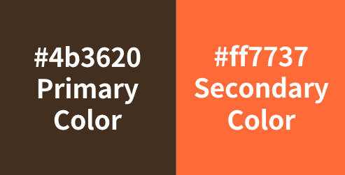

# 📚팔북정

## 서비스 기획

### 👥 팀 소개

|  팀원  |        역할        |                담당 파트                 |                  깃허브 주소                  |
| :----: | :----------------: | :--------------------------------------: | :-------------------------------------------: |
| 이현서 | 프로젝트 오너 (PO) |             상세 정보 페이지, 플로팅 버튼           |  [pistapixie](https://github.com/pistapixie)  |
| 김지윤 |   스크럼 마스터    | 메인 배너(블로그추천, 신간), 광고배너, 푸터  |   [kirnjiyun](https://github.com/kirnjiyun)   |
| 권혁준 |        팀원        |    카테고리 페이지, 페이지네이션    | [redhero8830](https://github.com/redhero8830) |
|  박샘  |        팀원        | 404,로딩,장바구니 및 구매 페이지 |    [seambark](https://github.com/seambark)    |
| 박영호 |        팀원        |  메인 도서 리스트(베스트, 신간, 추천)   |    [ZeroTTTT](https://github.com/ZeroTTTT)    |
| 이승희 |        팀원        |    검색 페이지, 페이지네이션     |      [HSLE24](https://github.com/HSLE24)      |

#### 프로젝트 목표

- 팀 목표
  - 목표 1
  - 목표 2
- 개인 목표
  - 팀원 1: 목표
  - 팀원 2: 목표
  - 박 샘: 리엑트에 좀 더 친숙해지고, 리액트로 협업 작업해보는 것이 목표였습니다.
  - 이승희: 다른 사람들과 함께 협업하는 과정을 경험해보고 싶습니다.

### 프로젝트 소개

- 배포 페이지 : https://palbookjung.netlify.app/
- 노션 페이지 : https://obtainable-stretch-0df.notion.site/8-c1b91720197948caa0e6d2817541547a

#### 🗓️ 개발 일정 및 진행방식

- 개발 기간: 2024.04.14 ~ 2024.04.21
- 진행 방식: 애자일, 스크럼, 일별 회의 등

#### 팀 컨벤션

- 깃 컨벤션
  - 브랜치 전략
  - 커밋 메시지 규칙 - 기본 형식: [태그] 제목
    예) [Feat] 리스트 랜더링 구현 - 태그 종류:
    Feat: 새로운 기능 추가
    Modify: 기존 코드의 수정
    Delete: 코드 또는 파일의 삭제
    Merge: 브랜치의 병합
- 코드 컨벤션
  - 코드 스타일
  - 네이밍 규칙
    - code-id: 카멜 케이스 사용
    - className: 카멜 케이스 사용
    - 함수명: 카멜 케이스 사용 예) showModal
    - 이벤트 함수명: handle 접두사 사용 예) handleClick
    - assets명: 띄어쓰기 대신 언더바 사용, 영어 사용 예) show_modal.jpg
    - 유틸함수: 별칭 사용 금지
    - 작명 시 줄임말 사용 금지: 명확한 의미 전달을 위해 줄임말을 사용하지 않습니다.

#### 🛠️ 기술 및 개발 환경

- 프론트엔드: 기술 스택 (예: React, Vue, Angular 등)
- 배포 환경: (예: AWS, Google Cloud, Heroku 등)

### 서비스 소개

#### 주제

- 서비스 개요
- 타겟 사용자
- 주요 기능

#### 디자인

- 로고 디자인
  

- 컬러 팔레트
  

## 📱기능 구현 (모바일 버전)

### 홈

- 메인페이지 스크롤

| 메인페이지 스크롤 |
| :---------------: |
|    사진넣는곳     |

- 배너 케러셀 작동하는거

| 메인페이지 |
| :--------: |
| 사진넣는곳 |

- 메인페이지에서 책 누르면 디테일로 넘어가는거 하나

| 메인페이지 |
| :--------: |
| 사진넣는곳 |

### 카테고리 페이지

- 카테고리 클릭하기

| 카테고리 클릭 |
| :-----------: |
|  사진넣는곳   |

### 검색 페이지

- 검색어 입력 후 키워드

| 검색어 입력 후 키워드 |
| :-------------------: |
|      사진넣는곳       |

- 검색어 입력하고 삭제버튼

| 검색어 입력 후 삭제 |
| :-----------------: |
|     사진넣는곳      |

### 디테일 페이지

- 전체 스크롤

| 상세페이지 스크롤 |
| :---------------: |
|    사진넣는곳     |

- 관련 기능

| 관련 기능  |
| :--------: |
| 사진넣는곳 |

- 관련 기능

| 관련 기능  |
| :--------: |
| 사진넣는곳 |

### 장바구니 페이지

- 페이지 1

| 장바구니 페이지1 |
| :--------------: |
|    사진넣는곳    |

- 페이지 2

| 장바구니 페이지2 |
| :--------------: |
|    사진넣는곳    |

### 기타 페이지

- 404 페이지

| 404 페이지 |
| :--------: |
| 사진넣는곳 |

## 🖥️ 기능 구현 (데스크탑버전)

| 메인페이지 스크롤 | 검색어 입력 후 결과 | 상세페이지 스크롤 |
| :---------------: | :-----------------: | :---------------: |
|    사진넣는곳     |     사진넣는곳      |    사진넣는곳     |

## 🖋️ 프로젝트 리뷰

### 📍 이슈 / 트러블 슈팅

- 이슈 1: 해결 방안
- 이슈 2: 해결 방안

### 📍 리팩토링 계획

- 리팩토링 대상 1
- 리팩토링 대상 2

### 📍 회고

- 프로젝트를 통해 배운 점

  - 서로 작업결과와 계획을 공유하는 것이 중요하다는 것을 배웠습니다.
  -
  - 처음 기초작업을 잘 하면 수정도 적다는 것을 다시한번 느꼈습니다.
  - 의사소통의 원할함을 위해서는 코드를 팀 스타일, 규칙에 맞춰서 작성하는 게 중요하다는 걸 배웠습니다.

- 개선해야 할 점
  - 기능적인 면을 보완하고싶습니다.
  -
  - 뭔가 공통적으로 작업하는것이 부족했던 것 같습니다.
  - CSS 부분을 좀 더 공부하고 보완해야 겠습니다.
- ## 향후 계획
  -
  - 카트나 찜하기 등의 기능들을 구현 못했는데 마저 해보고 싶습니다.
  - should 에 있던 장바구니나 로그인/로그아웃 기능까지 구현하면 좋을 것 같습니다.
